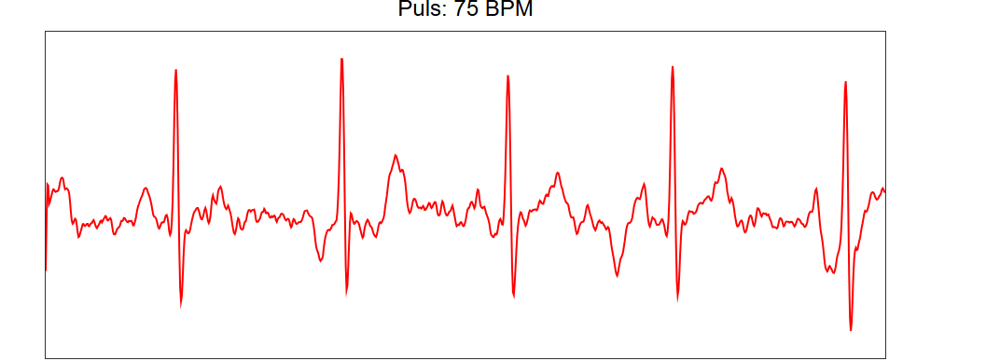
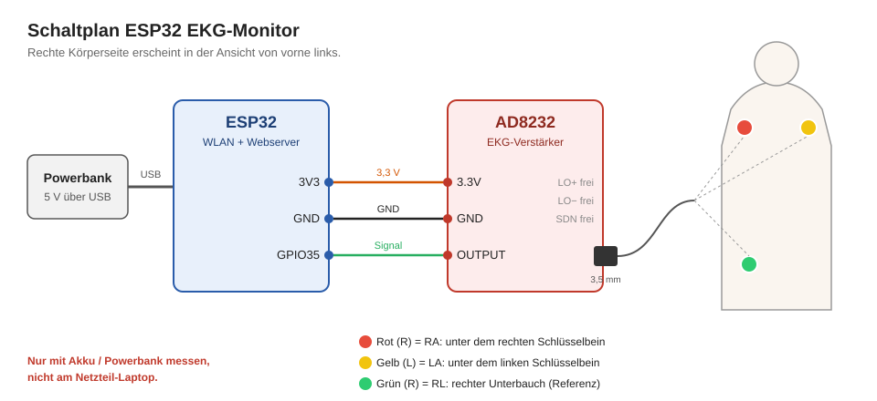
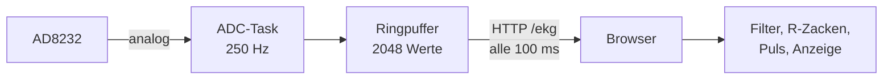

# ESP32 EKG-Monitor

Ein Ein-Kanal-EKG mit dem AD8232 und einem ESP32. Der ESP32 misst mit 250 Hz und zeigt die Kurve live im Browser an, per WLAN, ohne App und ohne Kabel zum PC.

> **Kein Medizinprodukt.** Dieses Projekt dient zum Lernen und Experimentieren. Es ist nicht für Diagnosen gedacht.

## Funktionen

- **Feste Abtastrate von 250 Hz** in einer eigenen FreeRTOS-Task, unabhängig vom Webserver
- **Live-Kurve im Browser** mit Raster wie auf EKG-Papier (40 ms / 200 ms)
- **50-Hz-Filter** gegen Netzbrummen (gleitender Mittelwert über 20 ms)
- **R-Zacken-Erkennung** mit Pulsanzeige (BPM) und RR-Abständen in ms
- **Pause und Zurückblättern** durch bis zu 10 Minuten Verlauf, Zoom von 2 bis 15 s
- **CSV-Export** der Rohdaten für die Auswertung in Python, MATLAB oder Excel
- **Warnung bei gelöster Elektrode**, wenn das Signal an 0 oder 4095 klebt

## Hardware

| Bauteil | Anzahl |
| --- | --- |
| ESP32 Dev Board | 1 |
| AD8232 EKG-Modul mit 3,5-mm-Elektrodenkabel | 1 |
| Einweg-Gelelektroden | 3 |
| Jumperkabel | 3 |
| Powerbank (USB) | 1 |

## Verkabelung

| AD8232 | ESP32 |
| --- | --- |
| 3.3V | 3V3 |
| GND | GND |
| OUTPUT | GPIO35 |
| LO+, LO−, SDN | nicht verbunden |

GPIO35 liegt an ADC1. ADC2 lässt sich nicht nutzen, solange das WLAN aktiv ist.

### Elektroden

| Farbe | Position | Aufgabe |
| --- | --- | --- |
| Rot (R) | unter dem rechten Schlüsselbein | RA, rechter Arm |
| Gelb (L) | unter dem linken Schlüsselbein | LA, linker Arm |
| Grün (R) | rechter Unterbauch | RL, Referenz |

## Funktionsweise

- Eine eigene **FreeRTOS-Task** liest den ADC mit `vTaskDelayUntil` exakt alle 4 ms und schreibt in einen **Ringpuffer**.
- Der Browser fragt alle 100 ms nach `/ekg` und bekommt **alle neuen Werte auf einmal** (ca. 25 Stück).
- Filterung, R-Zacken-Erkennung und Darstellung laufen im Browser. Der ESP32 muss nur messen und senden.

## Installation

1. **Arduino IDE** installieren und das Board-Paket **esp32 by Espressif** hinzufügen.
2. Im Ordner `firmware/ekg_monitor/` die Datei `secrets.example.h` kopieren, in `secrets.h` umbenennen und die WLAN-Daten eintragen.
3. `ekg_monitor.ino` öffnen, das ESP32-Board wählen und hochladen.
4. Den seriellen Monitor mit 115200 Baud öffnen. Dort steht die IP-Adresse.
5. Diese IP-Adresse im Browser öffnen, im selben WLAN.

## Was ich dabei gelernt habe

- **Abtastrate:** Die erste Version fragte jeden Wert einzeln per HTTP ab. Das ergab höchstens 20 Werte pro Sekunde, unregelmäßig, und die R-Zacken (ca. 100 ms) wurden verpasst. Erst die Messung auf dem ESP32 im festen Takt mit Pufferung ergab eine saubere Kurve.
- **Fehlersuche an der Hardware:** Dauerhaft 0 bedeutete einen Wackelkontakt an den Steckverbindungen. Dauerhaft 4095 heißt „Elektrode gelöst“ (Lead-off). Daraus entstand die automatische Warnung.
- **Netzbrummen:** Ein gleitender Mittelwert über genau 20 ms, also eine volle 50-Hz-Periode, löscht das Brummen fast vollständig.

## Sicherheit

- Während die Elektroden am Körper kleben, den ESP32 **nur über Akku oder Powerbank** versorgen, nicht über einen Laptop am Netzteil.
- Die Daten laufen per WLAN, ein USB-Kabel zum PC ist nicht nötig.

## Ausblick

- Herzfrequenzvariabilität (HRV) aus den RR-Abständen berechnen
- Digitale Filter (Hochpass gegen Grundlinien-Drift) direkt auf dem ESP32
- Anzeige auf einem OLED-Display ohne Browser

## Lizenz

MIT, siehe [LICENSE](LICENSE).
